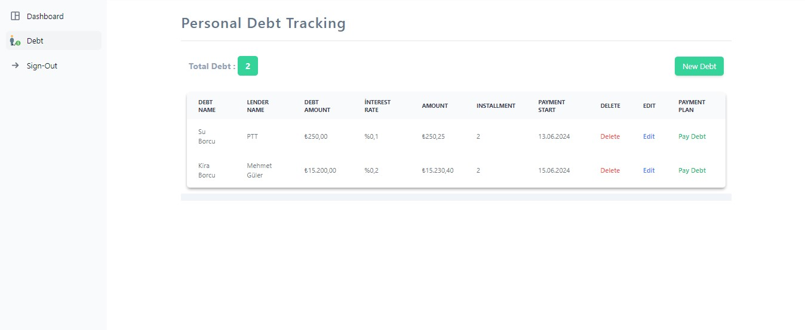

## Kişisel Borç Takip Uygulaması


https://github.com/musayar9/Personal-Debt-Tracking/assets/96313325/6eb175cb-8d6d-42d1-b80f-b30a88cbace5


### Kullanılan Teknolojiler


### Proje Ön Tanıtım

Bu proje, JavaScript'in güçlü framework'ü olan ``ReactJs`` ile geliştirilmiştir. Proje, durum yönetimi için ``react-redux ve redux-toolkit ``kullanmaktadır. Elde edilen verilerin localStorage'da saklanması işlemleri ``redux-persist`` kütüphanesi ile sağlanmıştır. Oluşturulan verilerin tip kontrolü ise ``TypeScript`` ile yapılmıştır. Uygulama içinde yönlendirme (routing) işlemleri için ``react-router-dom`` kütüphanesi kullanılmaktadır.

UI tasarımı için ise ``tailwindcss``, ``flowbite`` ve ``flowbite-react`` kütüphaneleri kullanılmıştır. Bu kütüphaneler, modern ve kullanıcı dostu bir arayüz oluşturmak için tercih edilmiştir.
### Proje İçeriği

Bu uygulama, kullanıcıların kendi kişisel borçlarını zahmetsizce yönetmelerini sağlar. İşte uygulamanın sunduğu harika özellikler:

- `Kişisel Borçlarınızı Oluşturun:` Kolay ve hızlı bir şekilde kendi borçlarınızı ekleyebilirsiniz.

- `Borç Taksitlendirme:` Borçlarınızı taksitlendirerek ödemelerinizi daha yönetilebilir hale getirin.

- `Borç Düzenleme:` Oluşturduğunuz borçları dilediğiniz zaman güncelleyebilir ve değişiklik yapabilirsiniz.

- `Borç Silme:` Borçlarınızı tek tıkla silebilirsiniz.

- `Yaklaşan Borç Ödemeleri:` Yaklaşan borç ödemelerinizi uygulama üzerinden kolayca gerçekleştirebilirsiniz.

- `Borç Takibi:` Borçlarınızın durumunu takip edebilir, ödeme tarihlerinizi kaçırmadan yönetebilirsiniz.

## İndirme İşlemler

1.  Githubdan ilgili repository kendi localinize klonlayın:

```javascript
git clone https://github.com/musayar9/Personal-Debt-Tracking.git
```

2. İnen dosyayı çalıştırmak için gerekli olan bağımlılıkları indirin

```
npm install
```

or

```
yarn
```

3. Projeyi Ayağa Kaldırma
   Bağımlılıkları indirdikten sonra, projeyi çalıştırmak için aşağıdaki komutları kullanabilirsiniz.

```
 npm run dev
```

or

```
yarn run dev
```

## Proje Sayfaları

### Kullanıcı Kayıt Sayfası

Bu sayfada kullanıcı uygulamaya kayıt oluyor kayıt işlemi gerçekleştikten sonra kullanıcı giriş sayfasına yönlendirilecek.


### Kullanıcı Giriş Sayfası

Bu sayfada uygulamaya kayıt olan kullanıcı artık uygulamaya email ve password bilgisiyle giriş yapabilecek. Sisteme giriş yapan kullanıcı dashboard sayfasına yönlendirilecek.


### Dashboard Sayfası

Uygulamaya ilk defa giriş yapan kullanıcın hiç bir borç kaydı bulunmadığı için `henüz borucunuz bulunmamaktadır` yazısı gözükecek. Aşağıda bulunan `create debt` butonun tıkldığında kullanıcı borç oluşturma sayfasına yönlendirilecek.


### Borç (Create Debt) Oluşturma Sayfası

Bu sayfada kullanıcı kendine özgü borçları oluşturabilir ve istediği aya kadar taksitlendirebilir.


### Borçların Dashboard Sayfasında Gösterilmesi

Bu sayfada kullanıcı toplam borç sayını görüntüleyebilir. Güncel olan borçlarını görebilir.


### Oluşturulan Borçların Borç(Debt) Sayfasında Gösterilmesi

Bu sayfada kullanıcı oluşturmuş olduğu tüm borçları tabloda görüntüleyebilir. Bu tabloda borca ait detaylı bilgiler bulunmaktadır.
Kullanıcı bu istediğini borcunu silebilir, düzenleyebilir ve borcunun ödeme işlemlerini yapabilir.



#### Borç Düzenleme

Kullanıcı tabloda `edit` butonuna tıkladığında iligili borc için borç düzenleme sayfasına yönlendirilecek.


#### Borç Ödeme

Kullanıcı tabloda `pay debt` butonuna tıkladığında ilgili borca ait olan borç bilgilerinin ve ödeme planını bulunduğu sayfaya yönlendirilecek. Kullanıcı bu sayfada ilgili borca ait olan taksit ödemlerini bu sayfadan yapabilir.


#### Borç Silme

Kullanıcı tabloda `delete` butonuna tıkladığında ilgili borcu tablodan silebilecektir.


### AnaSayfa

Kullanıcı navbar üzerinde yer alan `Home` linkine tıkladığında anasayfaya yönlendirilecektir.


### Oturumu Sonlandırma

Kullanıcı navbar üzerinde bulundan ve dashboard alanında bulunan `SignOut` butonlarından herhangi birine tıkladığında uygulamadan çıkış yapmış olacaktır.


